# 2025-02-12 - Project Proposal
After working on the project proposal, I believe we have a good idea. It is complex enough to challenge us, while also being within the scope of the class. Me and my group worked to complete our proposal this week. I was mostly responsible for the high-level requirements, visual aid, ethics, and safety sections. Beyond this, I helped contribute to each of the other sections as well. 

# 2025-02-18 - Discussion with Professor Fliflet
Professor Fliflet helped us brainstorm many other helpful ideas that will allow us to better complete our project. First, we will add in an LED to the heating system so it is easier for the user to identify when the heating component is activated. This also will make debugging easier. Additionally, we decided to not use hydrophobic spray. This would make our project much harder and put much more stress on the machine shop. This should allow us to better focus on our primary goals for the project.

# 2025-02-24 - Researching Parts
I have been looking into various different components to use for a variety of subsystems on the project. Primarily with the temperature sensor, it is difficult to find one that is easy to use and is waterproof (as to not break from rain). Temporarily I have settled on the temperature sensor listed below since it follows these requirements and appears to be user friendly.

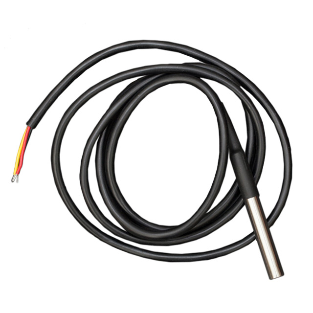

[Link to Temperature Sensor](https://www.digikey.com/en/products/detail/dfrobot/DFR0198/7597054)

Additionally, we have been reviewing and evaluating which microcontroller is best suited for our project. We have temporarily decided to go with an STM32 microcontroller since it has many online resources to help us interact with it. Additionally, the ECE445 website has a wiki page which we find very helpful in learning about using this microcontroller. 

[Link to STM32 Microcontroller](https://www.digikey.com/en/products/detail/stmicroelectronics/STM32F103C8T6/1646338?gad_source=1&gad_campaignid=20228387720&gbraid=0AAAAADrbLli0HEOCvU7hnHtUCJVnRv56k&gclid=CjwKCAjwiezABhBZEiwAEbTPGJGlC1bv2hwAZEP8Ci_ukTb_uifL9ZXMQJEL6_99KdYOhY4laoM0OBoC1ooQAvD_BwE&gclsrc=aw.ds)

After meeting with my team, we have also decided to not use any humidity sensor. We think it will be very difficult to incorporate this into our design since it would complicate the schematics greatly and possibly cause blockage of the camera. We will try to revisit this and add it to our project later if there is time at the end. However, we believe our project can still function effectively without this. 

# 2025-02-27 - First PCB
Since we do not think our first PCB is ready to order yet, we are going to spend more time on it and ensure it will work before ordering. This means we will be placing our first PCB order in the second-round orders. So far, we have constructed a PCB that has a majority of the components we need, however, we need to add any necessary resistors and capacitors for these components, as well as research any additional components we may need. 

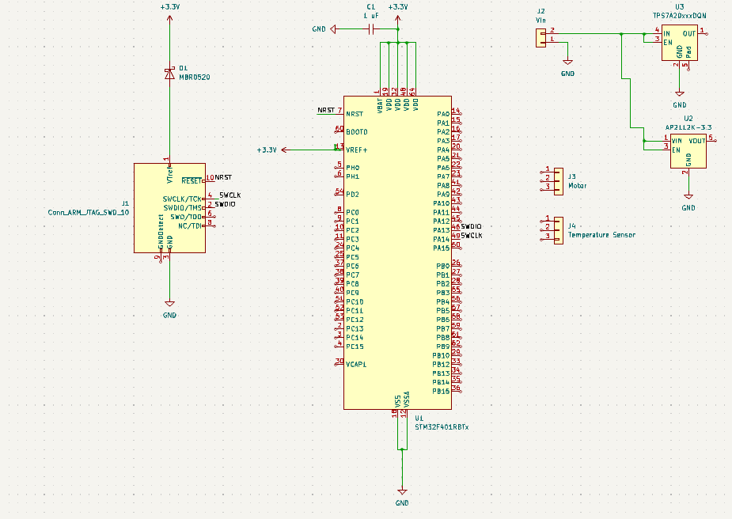

# 2025-03-01 - First PCB (Continued)
We have added multiple other components to our PCB. This includes a receiver to communicate with the computer in the form of a USB-C 2.0 port. Additionally, we added a component to plug the heater into. Finally, we added another voltage regulator in order to power the heater, which we realized needs 5 V to power. 

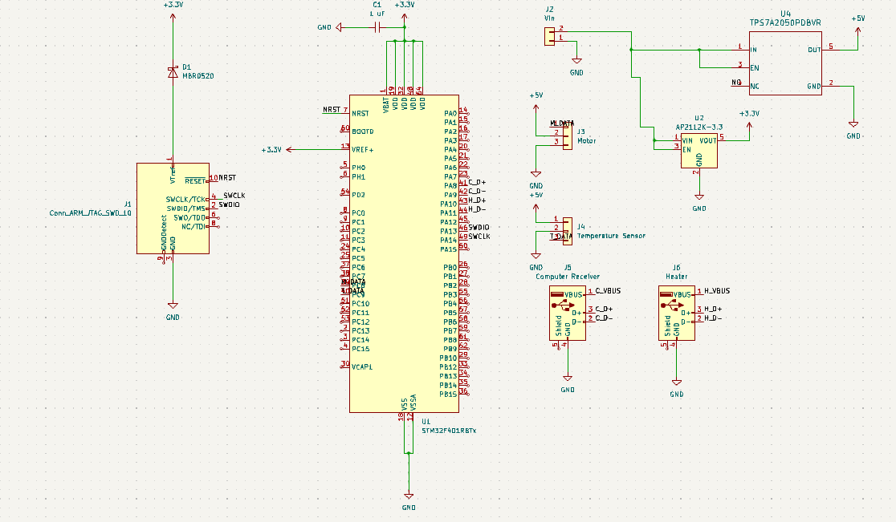

# 2025-03-05 - Design Document
Me and my group spent lots of time working on our design document this week. We want to make sure we are thorough with our work so that we can effectively build and test our project later. While my group members and I all played a role in each section, I was primarily responsible for the following sections: cost, schedule, high-level-requirements, visual aid, ethics, safety, and citations. 

# 2025-03-06 - First PCB (Continued)
I have continued working on our PCB design and believe we are now at a point where we can place our order. We have added a MOSFET which will allow for the heater to properly run. We have also added a spot for the LED light, the debug header, the timing crystals, and more. Additionally, we added many more resistors and capacitors which we needed in our design.

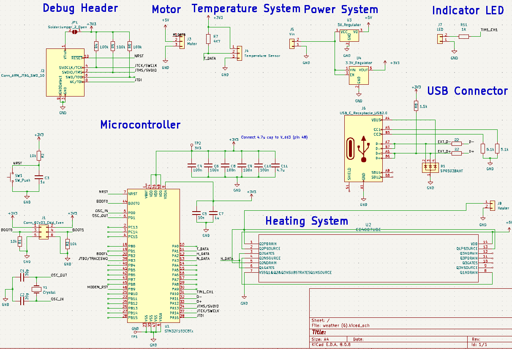

# 2025-03-07 - Temperature Sensor Readings
I have been working with our temperature sensor (DFR0198) and our development board in order to try to get proper readings with the device. Unfortunately, I am continuously getting errors reading from the device. I am able to properly communicate a “reading” from the microcontroller to my computer for me to visualize using UART and displaying it with Putty. However, the readings are coming in as gibberish characters, meaning there is either a problem with the data line, the temperature sensor itself, or how I am reading it. 

# 2025-03-08 - Breadboard Assembly
My group has tried to begin assembling the parts together utilizing our development board, in order to have some subsystems working in time for the breadboard demo. Currently we plan to show the temperature sensor readings (even though they are incorrect), the PWM generation from our development board, and our CNN model. 

# 2025-03-13 - Temperature Sensor Readings (Continued)
Since I am unable to get proper readings using the DFR0198 temperature sensor, I have attempted to get readings using the on-board temperature sensor. This has worked and we will be using this method going forward. Once the PCB is working, I plan to revisit the temperature sensor issue and try once again to obtain correct readings. 

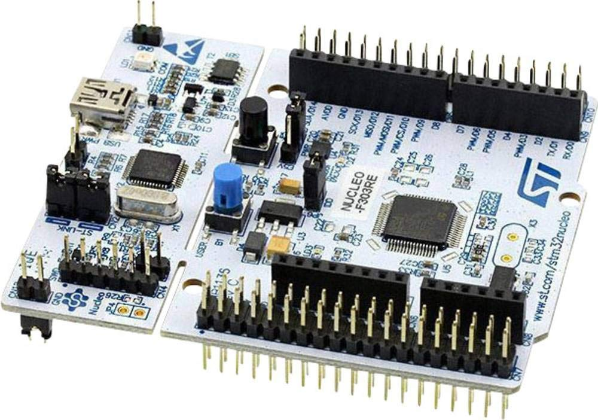

[Link to STM32 Development Board & Image](https://www.amazon.com/Nucleo-64-development-STM32F303RE-supports-connectivity/dp/B01N6EKDEF)

In order to verify my results, I conducted 20 trials where I read the temperature from the development board and compared it to the actual temperature. I did this by testing a few various environments which slowly became colder. I waited for the temperature sensor to adjust and then compared this to the thermometer readings. After the following results, I concluded that it was accurate.

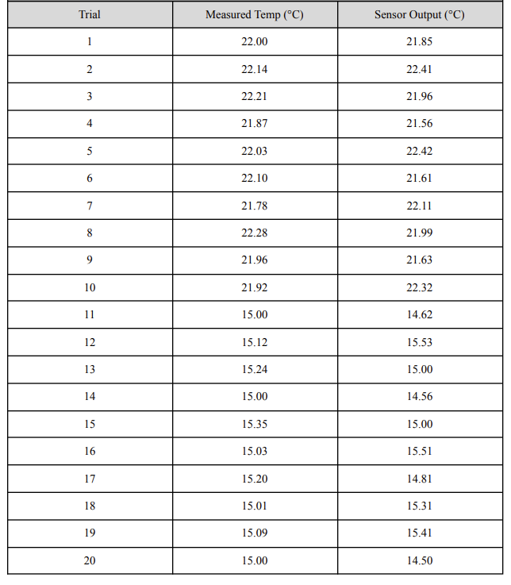

# 2025-03-25 - First PCB Assembly
We have begun soldering our first PCB. We are attempting to solder it in subsystems in an attempt to unit test each subsystem. Some of our subsystems we have soldering and verified work, such as the power subsystem. We know certain parts of our PCB will not work because we realized mistakes we had made after ordering it. This came in various forms such as forgetting pull-up resistors in certain areas, utilizing the incorrect components, and more. Because of this, we were not able to solder and test everything. 

# 2025-04-03 - Second PCB
After noting errors that prevented us from being able to effectively assemble and test our PCB, we started creating our next PCB which revised these errors. We corrected the MOSFET circuit, the temperature sensor circuit, and more. We plan to finalize these changes and order the PCB as soon as possible. 

# 2025-04-08 - Breadboard Assembly
In case our PCB still fails we are attempting to assemble everything together utilizing the development board and a breadboard. I have begun programming the microcontroller to trigger the heater and motor based on the temperature sensor readings. I am also practicing various ways to use python to trigger a high pin output on the board. This is important because we need the OpenCV model to be able to trigger the motor physically. I am attempting to do this communication through UART and the TX/RX pins. Below is the microcontroller code I have so far in order for the temperature to trigger the heater:

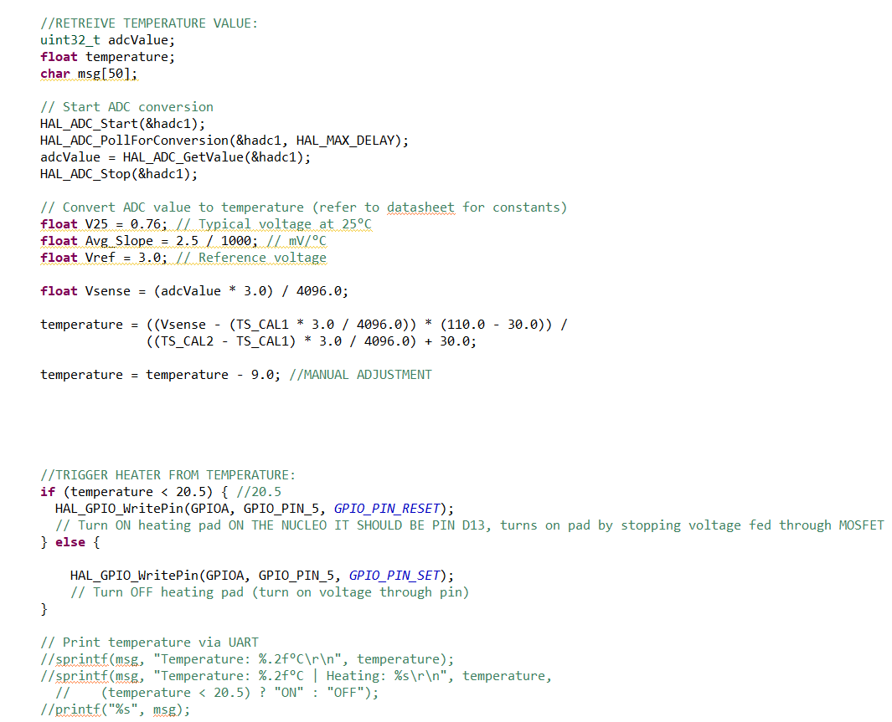

# 2025-04-10 - Breadboard Assembly (Continued)
I have been able to find a way to communicate from Python to the Development board in order to have the OpenCV model directly trigger the motor. Here is the code I am using to do this: 

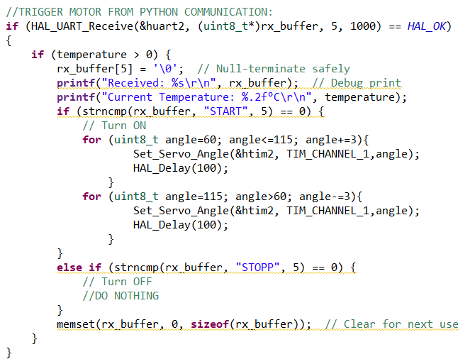
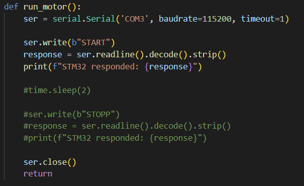

# 2025-04-23 - Second PCB Assembly
When assembling our second PCB, we broke our microcontroller. Unfortunately, we were not able to solder the microcontroller due to the intricacies of its parts. We are going to try and order another one in time and attempt to solder it again, however, we are also going to shift our focus to making sure our final project works on the development board in order to ensure we have a final working product.

# 2025-04-25 - Final Demo Preparation
My group now has our final project working on our development board. We are able to trigger various subsystems from other subsystems. We are now going to start practicing what we want to show for our final demo so that we are prepared to showcase both our end-to-end functionality along with our subsystems verifications. We are using a cooler filled with ice in order to imitate a freezing environment, however, this does not replicate a perfect freezing temperature. In order to adjust for this, we will simulate our conditions where 20 degrees Celsius is our threshold for freezing, instead of 0 degrees Celsius. Below is our final layout of our microcontroller:

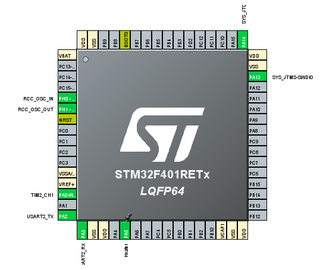

Below I have attached images of our final product constructed all together so it can be visualized easier:

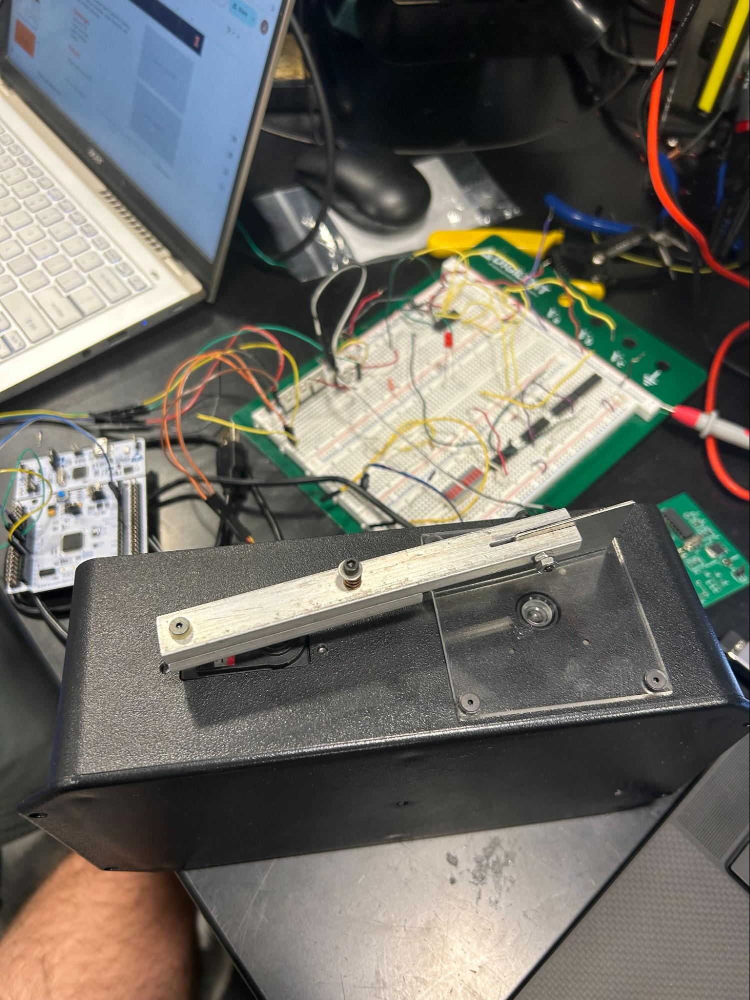
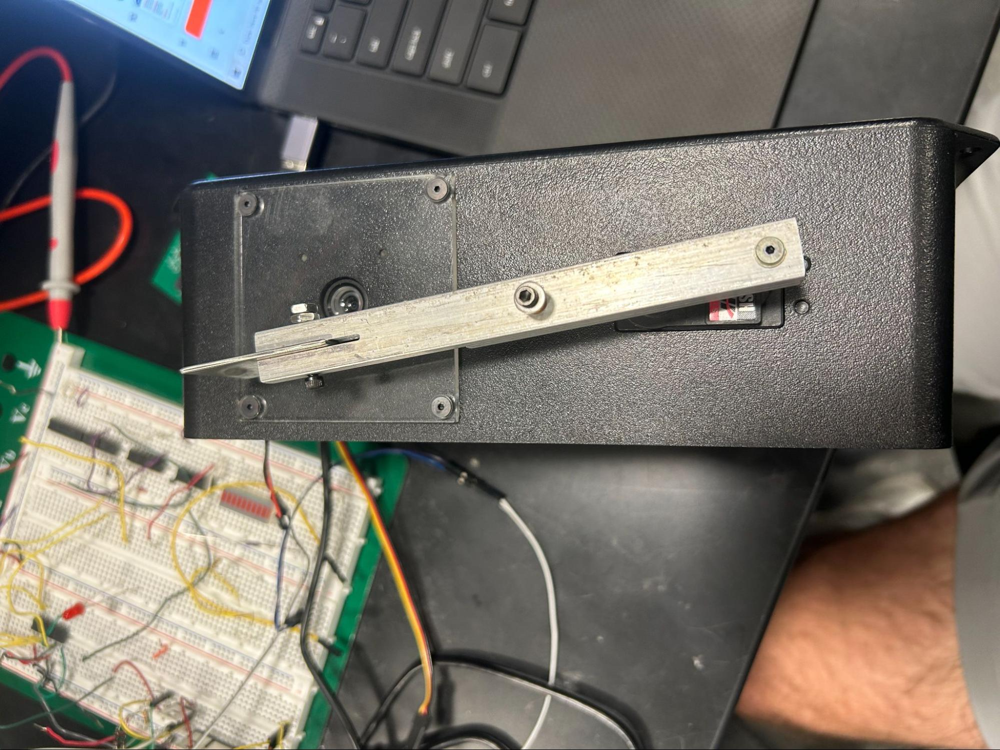
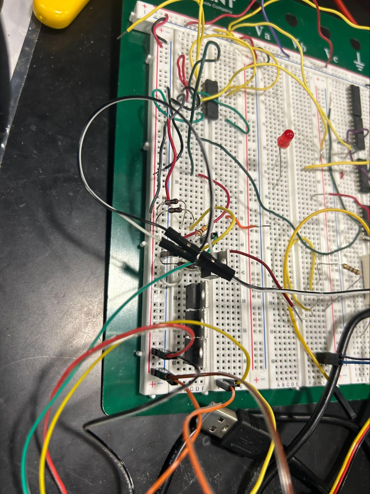
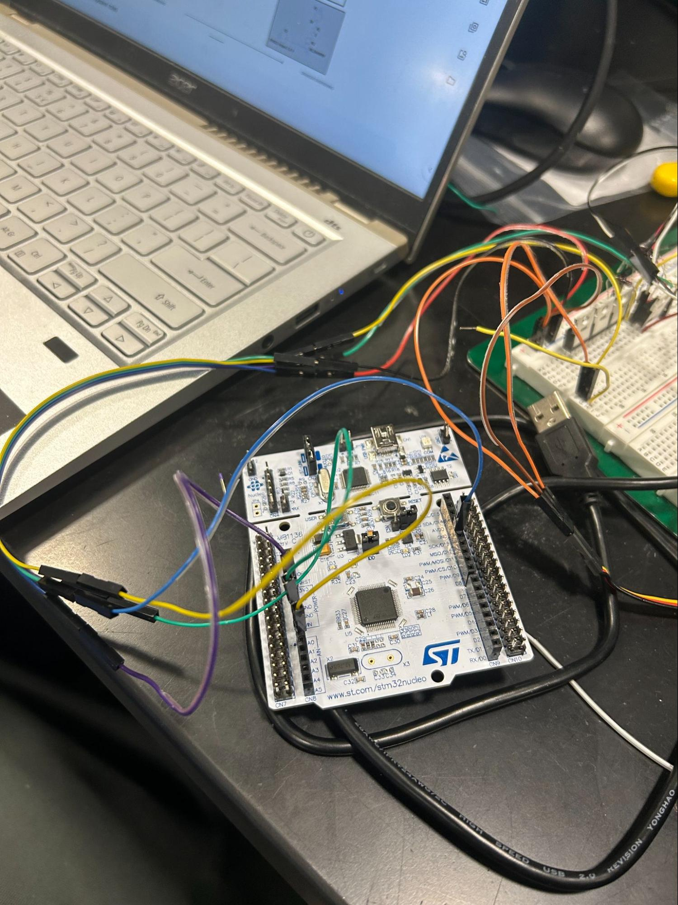
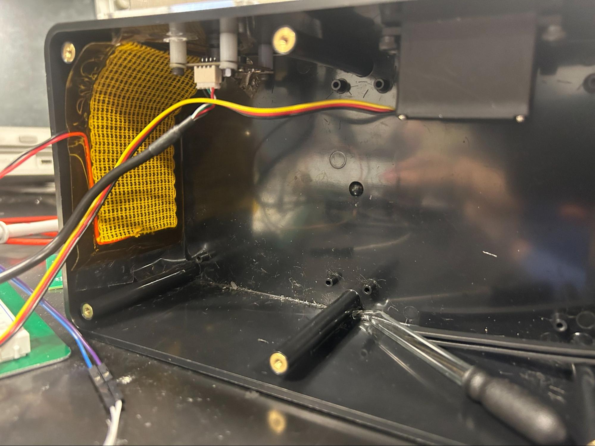

# 2025-04-30 - Final Presentation Preparation
Our final demo went great and we were able to successfully showcase full end-to-end functionality. We are now diverting our attention to the final presentation where I am practicing what to say for my slides, along with making sure my slides communicate all of the necessary information. 

# 2025-05-07 - Recap
The final presentation went very well and I think my group did a great job communicating our information and results. I am very proud of all of the work I have put into this project all semester and I am excited to use this experience in the future. 

# Additional References

 
[1] 	IEEE, “IEEE Citation Guidelines,” IEEE Dataport, [Online]. Available: https://ieee-dataport.org/ 
sites/default/files/analysis/27/IEEE%20Citation%20Guidelines.pdf. [Accessed: Feb. 12, 2025].
 
[2]	HS-318 Servo-Stock Rotation, “HS-318 Servo-Stock Rotation,” ServoCity®, 2025. 
https://www.servocity.com/hs-318-servo/. [Accessed: Mar. 6, 2025].
 
[3]	“0.3 MegaPixels USB Camera for Raspberry Pi and NVIDIA Jetson Nano 
SKU:FIT0701.” Available: https://mm.digikey.com/Volume0/opasdata/d220001/medias/docus/ 
2719/FIT0701_Web.pdf. [Accessed: Mar. 6, 2025].
 
‌[4]	“Waterproof DS18B20 Digital Temperature Sensor for Arduino.” Accessed: Mar. 06,      
2025. [Online]. Available: https://mm.digikey.com/Volume0/opasdata/d220001/medias/docus/ 3786/DFR0198_Web.pdf. [Accessed: Mar. 6, 2025].
 
[5]	“NUCLEO-F401RE - STM32 Nucleo-64 development board with STM32F401RE MCU, 
supports Arduino and ST morpho connectivity - STMicroelectronics,” www.st.com. https://www.st.com/en/evaluation-tools/nucleo-f401re.html. [Accessed: Mar. 6, 2025].
 
‌[6]	“Heating Pad -5x10cm.” Accessed: Mar. 06, 2025. [Online]. Available: https://mm.digikey.com/ 
Volume0/opasdata/d220001/medias/docus/2511/COM-11288_Web.pdf. [Accessed: Mar. 6, 2025].
 
[7]	“STM32F103C8 - STMicroelectronics,” STMicroelectronics, 2019. https://www.st.com/en/ 
microcontrollers-microprocessors/stm32f103c8.html. [Accessed: Mar. 6, 2025].
 
‌[8]	Engineering IT Shared Services, “:: ECE 445 - Senior Design Laboratory,” Illinois.edu, 
2025. https://courses.grainger.illinois.edu/ece445/wiki/#/stm32_example/index?id= stm32- example-lora-router. [Accessed: Mar. 6, 2025].
 
[9]	“Servo Motor Control with STM32 | EASY TUTORIAL | STM32CUBEIDE,”
Youtube, uploaded by CircuitGator HQ, 15 January 2025, https://www.youtube.com/watch?v=0aTMuiHVx_g. [Accessed: Apr. 2, 2025].

