# **02-11-2025: Project Proposal**

Our group collaborated on the proposal for the weather-resistant camera project, working together to divide the system into seven core subsystems: the heater, sensor, microcontroller, wiper, power, computer, and camera. Early in the process, we held discussions to outline each subsystem's role and ensure that the overall design was cohesive. I contributed by writing the *Introduction* and *Proposed Solution* sections of the proposal, helping to clearly explain the motivation behind our project and the strategy we planned to use. Additionally, I worked on part of the *Subsystem Overview*, describing how the different components would function and interact to maintain clear camera visibility in adverse weather conditions.

# **02-14-2025: Initial Machine Shop Meeting**

Another group member and I brought our proposal to the machine shop, where we explained the functionality of our project and how the system was intended to operate. While there, Greg offered valuable input on the physical design, suggesting the use of protective boxes for housing components and helping us select appropriate servo motors. He also provided ideas for implementing the heating element, guiding us on possible materials and configurations that could effectively support our system’s de-icing capabilities.

# **02-18-2025: Proposal Review with Professor Fliflet**

During the proposal review, Professor Fliflet gave us several valuable ideas for implementation through his detailed questions. He prompted us to consider specific aspects such as the size of the enclosure box and where individual components—like the sensor, heating element, and wiper—should be placed for maximum efficiency. These questions helped us think more carefully about our layout and pushed us to refine the physical design of the system to ensure everything fits properly and functions as intended.

# **02-24-2025: Researching Parts**

As part of my contribution, I focused on researching potential camera modules for the system. After evaluating several options, I identified the DFRobot FIT0701 as a cost-effective and practical solution that aligns well with our project’s technical and budgetary requirements. It provides the necessary image quality without introducing unnecessary complexity. Additionally, during our discussions, we concluded that a humidity sensor would not be necessary for our application. As a group, we also agreed to use the STM32 microcontroller, as some team members have prior experience with it and it offers the capabilities we need to coordinate the different subsystems effectively.

[Link to Camera](https://www.digikey.com/en/products/detail/dfrobot/FIT0701/13166487?gad_source=1&gad_campaignid=20243136172&gbraid=0AAAAADrbLlj-84fmJAQSRzRcbaOOckQ3k&gclid=Cj0KCQjwrPHABhCIARIsAFW2XBMLRvPHxX41c7tfAC-OobRcOUIvf58CpztnXms1-VtTUF1we62oBYoaAnx2EALw_wcB&gclsrc=aw.ds)
# 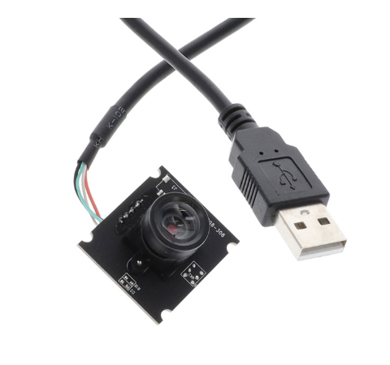

# **02-25-2025: First PCB**

Using the components we selected through our research, our group collaborated to begin designing the PCB. We have a general understanding of how most parts need to interface with the board—for example, we know that the motor will require three connectors. However, we’re still working out how to properly route the pins from the microcontroller to the other components on the board. Our PCB design so far is based on the structure and workflow we learned during the KiCad assignment. The current version of our layout is shown below.

# 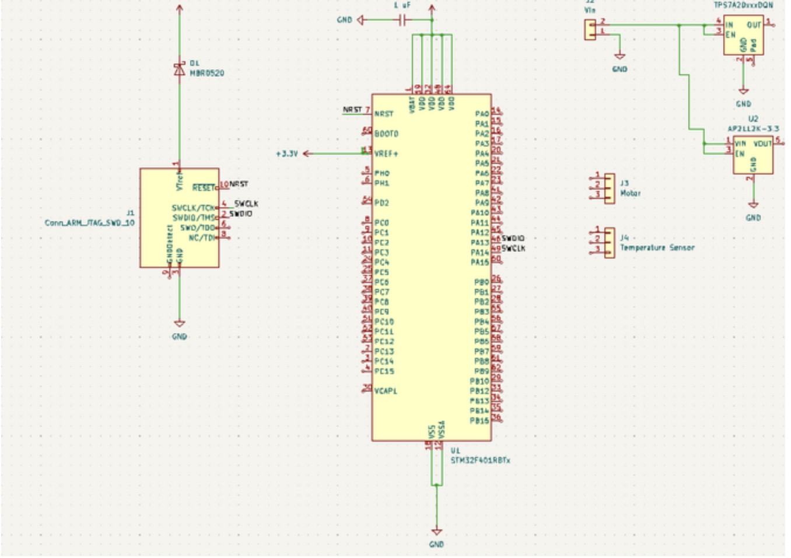**02-27-2025: First PCB (Continued)**

Our group met during office hours to review our initial PCB design and received valuable guidance that led to several important updates. We realized we needed to add additional components, including a USB connector to support the computer and heater subsystems, as well as crystal oscillators to ensure proper timing functionality for the microcontroller. We also discovered that the 5V voltage regulator we had originally chosen was not appropriate for our system and replaced it with a more suitable option. These changes helped refine our design to better meet the needs of our subsystems. The updated PCB layout is shown below.
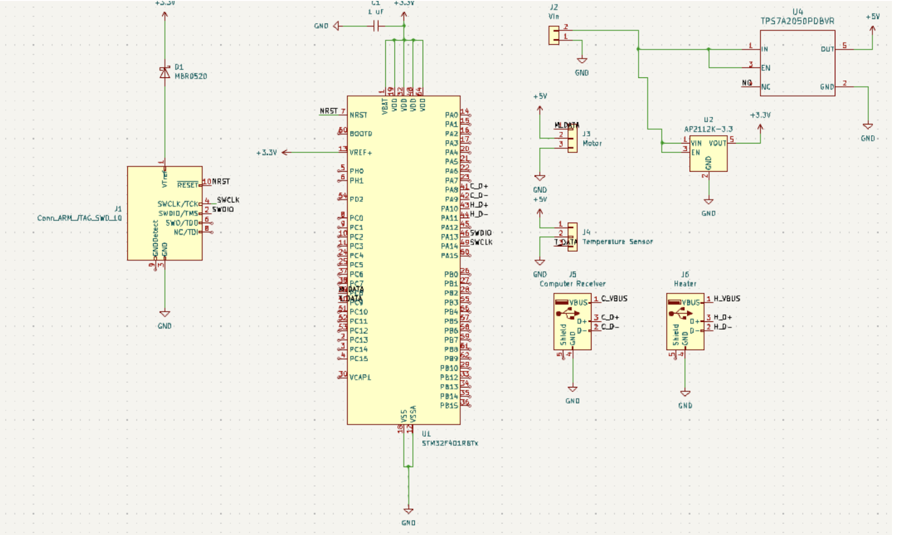
# **2-28-2025: PCB Review**

During the PCB review, our group met with a TA who showed us a reference design for the STM32 microcontroller on the course website. This example became the foundation for our updated PCB layout, and we made several important adjustments based on it. One major change was switching the specific STM32 microcontroller we were using to better align with the example and ensure compatibility with our design.

We also decided to move away from using a heater that required a USB connection and instead selected one that only needed power and ground. To allow the microcontroller to control the heater, we incorporated a logic level shifter to convert the STM32’s 3.3V signal to the 5V required by the heater. Additionally, we added LEDs—particularly for the heater subsystem—to serve as visual indicators and aid in debugging.

These updates led us to significantly revamp our original PCB layout, and we now follow the STM32 reference design much more closely to ensure functionality and simplicity.

# **03-05-2025 : Design Document**

My group and I dedicated a significant amount of time this week to developing our design document. We aimed to be as thorough and detailed as possible to ensure a smooth path forward during the build and testing phases of our project. While all group members contributed across different sections, I was primarily responsible for writing the *Introduction*, *Problem Statement*, and *Proposed Solution*. I also contributed to parts of the *Design* section, specifically by helping write the *Subsystem Descriptions*, where we outlined the purpose and functionality of each major component in our system.

# **03-06-2025 : Continuing PCB Design**

As a group, we’ve continued refining our PCB design and now feel confident that it’s ready for ordering. Since the previous version, we’ve made several important additions, including a MOSFET to enable proper control of the heater, as well as spots for the LED indicator, debug header, timing crystals, and other key components. We also added additional resistors and capacitors that were necessary to support the circuit’s stability and functionality.

With the changes inspired by the STM32 example from the wiki page shown during the PCB review—and the integration of the MOSFET circuit—we arrived at our third iteration of the PCB design. This latest version reflects a more complete and robust layout, positioning us well for the next phase of the project.
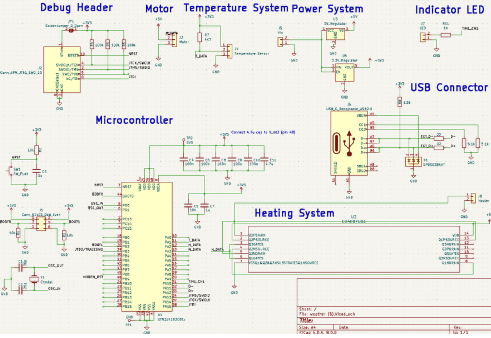
In addition to our hardware progress, today I focused on the computer vision portion of the project. Using OpenCV, I was successfully able to interface with the selected camera and display a live video feed on the computer. This was an important step in validating the functionality of the camera subsystem and ensuring it integrates smoothly with the rest of our system.

# **03-07-2025 : OpenCV algorithm**

For the raindrop detection portion of the project, we initially attempted to use a convolutional neural network (CNN) for real-time detection. While the model performed reasonably well on its own, integrating it with the live camera feed introduced significant lag, making it too slow for real-time operation. As a result, we decided to switch to a purely OpenCV-based approach for detecting raindrop-like obstructions on the camera lens.

I’ve been actively working on developing and testing this OpenCV-based detection method. Using a range of test images, I’ve confirmed that the algorithm can identify potential raindrop patterns. However, we are still encountering a high number of false positives, where glare, lighting artifacts, or surface textures are mistakenly flagged as raindrops. I'm continuing to refine the detection logic to improve accuracy and reduce noise in the results ahead of the final demo.
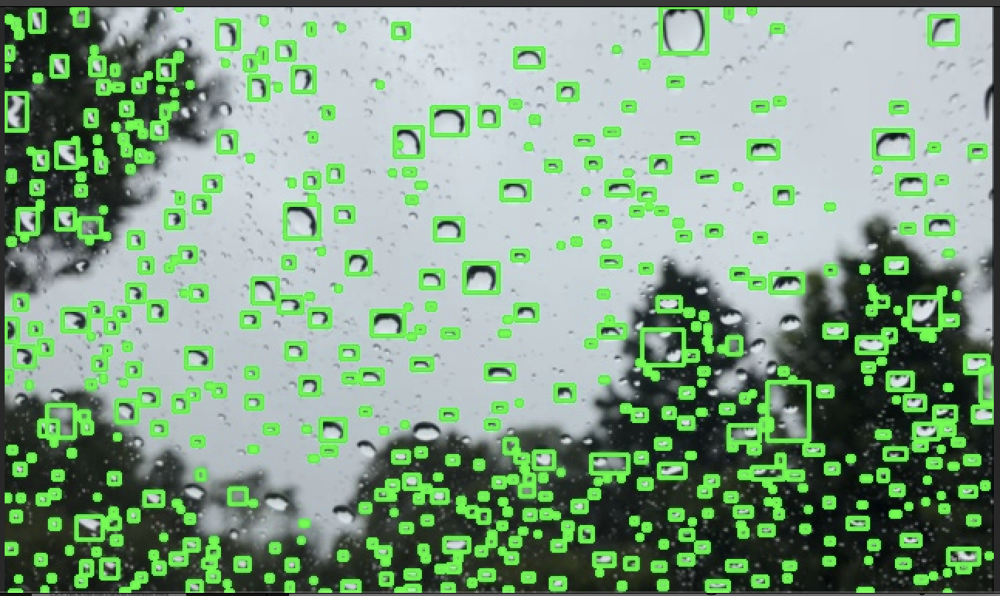
# 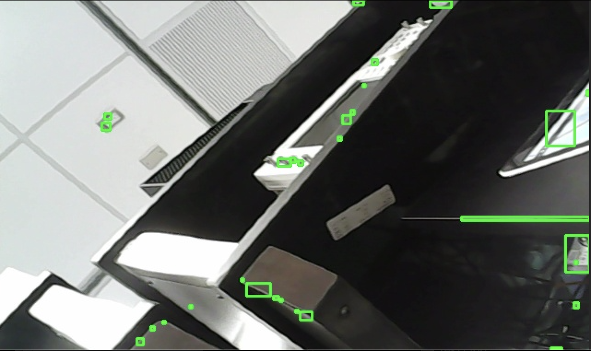

# **03-08-2025 : Breadboard Assembly**

To prepare for the upcoming breadboard demonstration, our group has begun integrating various components using the development board. The goal is to have a few key subsystems functioning to showcase our early progress. At this stage, we’re planning to present live temperature readings (though we’re still troubleshooting accuracy issues), demonstrate PWM signal output from the development board, and show the live camera feed using OpenCV with some rain drop detection. These demos will give us a chance to verify that our setup is on the right track and help us identify what still needs refinement moving forward

# **03-11-2025 : Breadboard Assembly**

We met today over Zoom to finalize the PCB wiring for our second-round submission. As a group, we worked together on placing the components, and another team member completed the remaining wiring. While all connections have been routed and there are no unrouted wires left, the design still does not pass the Design Rule Check (DRC), so we’ll need to make additional adjustments before it's ready to be sent

# **03-14-2025 : Machine Shop**

I visited the machine shop with another group member, where we spoke with Greg about the physical build of our project. He advised us to come back next time with a design based on a box he provided us during the visit. Greg also mentioned that our project wouldn’t take long to fabricate, so there was no need to submit anything to him before Spring Break.

# **03-25-2025 : Soldering the first PCB**

We’ve started soldering our first PCB, focusing on assembling it subsystem by subsystem so we can unit test each part individually. So far, we’ve successfully soldered and verified the power subsystem—both voltage regulators are functioning as expected, providing 5V and 3.3V outputs. The MOSFET circuit is also outputting 5V, which is consistent with the absence of a control signal from the microcontroller.

However, we’ve identified several design issues that are preventing us from fully soldering and testing the entire board. These include missing pull-up resistors in certain areas and a few incorrect component choices. Unfortunately, these errors were only discovered after the PCB had been ordered, so we’re working around them where possible and focusing on verifying the subsystems that are still testable.

# **03-31-2025 : Machine Shop**

We provided Greg with our updated design for the enclosure, and during our visit, he helped us test the servo motor using a servo tester. Through this, we confirmed that the motor was indeed broken, which helped us rule out wiring or code as the issue.

# **04-05-2025 : Working on OpenCV**

I’ve been actively working on refining the raindrop detection system to reduce the high number of false positives we’ve been encountering with the OpenCV-based approach. After running tests on a variety of images, I noticed that the algorithm often misidentifies glare, textures, or small distortions as raindrops. To address this, I’ve experimented with different filtering techniques and parameter tuning within the OpenCV pipeline.

I also met with our TA to troubleshoot the issue further. Through that discussion, we identified a key contributing factor: the mechanical setup of the camera places it too close to the surface where raindrops form. As a result, the camera is too zoomed in, which causes minor visual inconsistencies to appear more pronounced, leading to an increased rate of false detections. This insight has helped us better understand the limitations of our current hardware configuration and will inform future design adjustments.

# **04-12-2025 : Working on OpenCV (Continued)**

Over the past few weeks, I’ve been developing an OpenCV-based algorithm specifically tailored to work with our mechanical camera setup, where the lens is positioned very close to the surface where raindrops form. This proximity created challenges with image clarity and scale, but I was able to create a solution that effectively highlights the dark edges of raindrops, improving detection accuracy within our constrained setup.
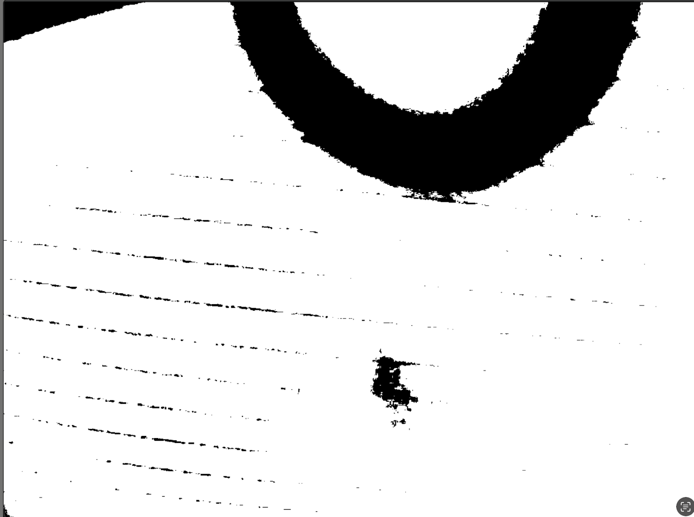
# **04-14-2025 : Working on OpenCV (Continued)**

Building on the detection of dark raindrop edges, the next step in the algorithm involves enclosing these edge contours within circles to approximate the full shape of each raindrop. Once the circles are established, we can fill in the interior regions—initially containing lighter pixels—with black pixels. This allows us to better estimate the true coverage of the screen by raindrops, rather than relying solely on edge data. By filling in these regions, we can quantify the percentage of the camera view obstructed by raindrops more accurately, which can then be used to trigger responses from other subsystems such as the wiper or heater.
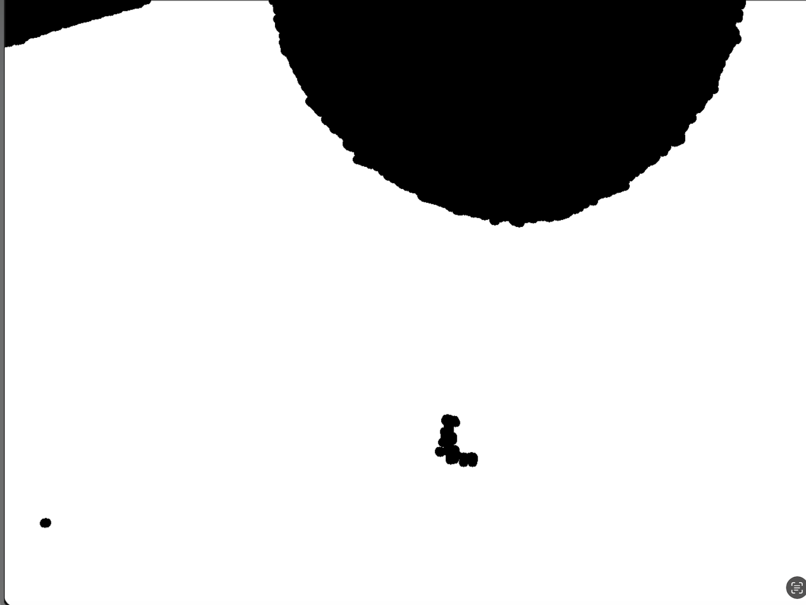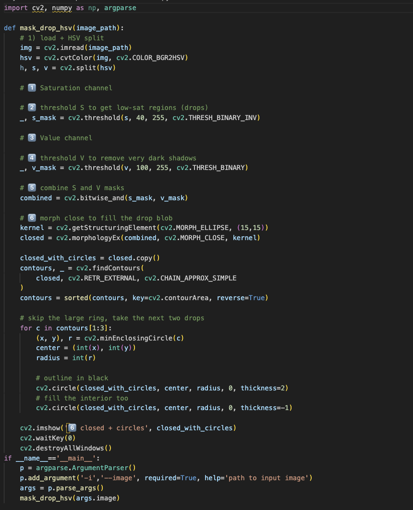
# **04-19-2025 : Testing OpenCV algorithm**

To evaluate the effectiveness of this approach, I conducted 100 test trials using a range of images. These tests allowed us to assess the consistency of the detection method and better understand its strengths and limitations under varying conditions.
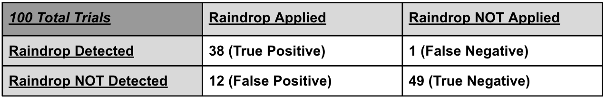
# **04-23-2025 : Attempting to Solder Second PCB**

While assembling our second PCB, we unfortunately damaged the microcontroller. Its small size and fine-pitch pins made it extremely difficult to solder by hand, and we were ultimately unable to attach it properly. Since we didn’t have a replacement microcontroller on hand—and with final demos coming up soon—there’s a strong chance we won’t receive a new one in time. Because of this, we’ve decided to shift our focus to ensuring the entire system works reliably on the development board. This will allow us to still present a fully functional project, even if the second PCB isn’t operational by the time of the demo.

# **2025-04-25 : Final Demo Preparation**

Our group now has the final project fully functioning on the development board, with successful interaction between subsystems—each component is able to trigger others as intended. We’re now shifting our focus to rehearsing for the final demo to ensure we clearly demonstrate both the overall end-to-end functionality and the verification of individual subsystems. To simulate a freezing environment, we’re using a cooler filled with ice. While this setup doesn’t create a perfect 0°C condition, we’ve adjusted our testing by setting 20°C as our freezing threshold. This allows us to demonstrate system behavior under controlled, repeatable conditions.

# 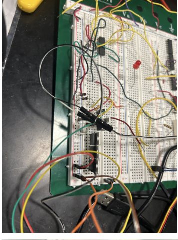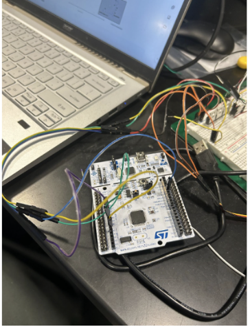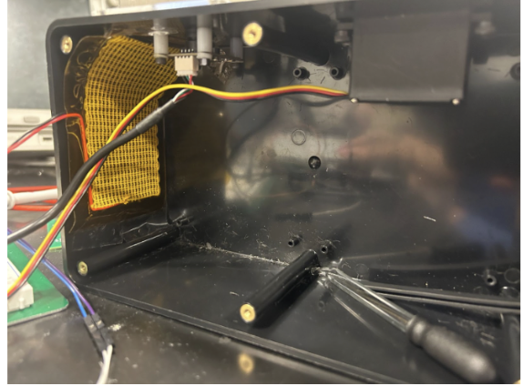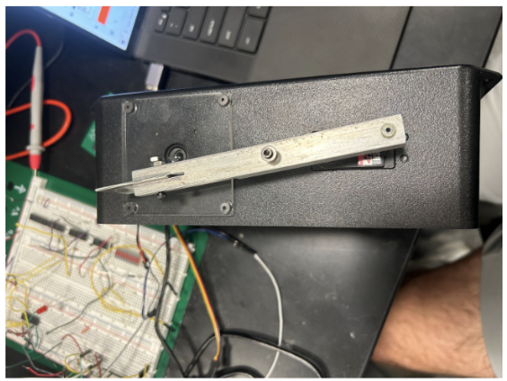
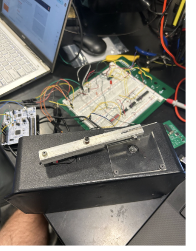
# **04-30-2025 : Final Presentation Preparation**

Our final demo was a success—we were able to demonstrate full end-to-end functionality with all major subsystems working as intended. The microcontroller generated PWM signals to control the servo motor, and the MOSFET circuit successfully toggled the heater on and off based on control signals. The temperature sensor provided accurate and consistent readings, confirming that it was functioning as expected. For the computer subsystem, we used OpenCV to display a live video feed from the camera and run our raindrop detection algorithm. The system was able to identify visual obstructions, effectively simulating how it would detect raindrops in real-world conditions. We also confirmed that the LED indicator correctly lit up to signal when the heater was active, providing clear visual feedback.

With the demo behind us, we’ve now shifted our attention to the final presentation. I’ve been practicing my portion to clearly explain the motivation, design process, and technical contributions. I’m also fine-tuning my slides to ensure they highlight how each subsystem worked together and how we successfully met our project goals.

# **05-07-2025 : Completion**

Our group just finished the final paper, completing the project. I was responsible for the Requirements and Verification portion for both the individual subsystems and the high level requirements. I also imported all the experiments/data required to demonstrate verification for all the requirements.

# **6 References<u></u>**

[1] 	A. B. Author, “Let it snow: Winter testing for cars, robots, and drones,” Areaxo, [Online]. 
Available:https://areaxo.com. [Accessed: Feb. 12, 2025].

[2] 	Automated Vehicles and Adverse Weather Final Report, Battelle, U.S. Department of 
Transportation Office of the Assistant Secretary for Research and Technology, Federal Highway Administration, FHWA-JPO-19-755, June 2019. [Online]. Available: www.its.dot.gov/index.htm. [Accessed: Feb. 12, 2025].

[3] 	IEEE, “IEEE Code of Ethics,” IEEE Corporate Governance, [Online]. Available: 
https://www.ieee.org/about/corporate/governance/p7-8.html. [Accessed: Feb. 12, 2025].

[4] 	ACM, “ACM Code of Ethics,” ACM, [Online]. Available: 
https://www.acm.org/code-of-ethics. [Accessed: Feb. 12, 2025].

[5] 	IEEE, “IEEE Citation Guidelines,” IEEE Dataport, [Online]. Available: https://ieee-dataport.org/ 
sites/default/files/analysis/27/IEEE%20Citation%20Guidelines.pdf. [Accessed: Feb. 12, 2025].

[6]	HS-318 Servo-Stock Rotation, “HS-318 Servo-Stock Rotation,” ServoCity®, 2025. 
https://www.servocity.com/hs-318-servo/. [Accessed: Mar. 6, 2025].

[7]	“0.3 MegaPixels USB Camera for Raspberry Pi and NVIDIA Jetson Nano 
SKU:FIT0701.” Available: https://mm.digikey.com/Volume0/opasdata/d220001/medias/docus/ 
2719/FIT0701\_Web.pdf. [Accessed: Mar. 6, 2025].

‌[8]	“Waterproof DS18B20 Digital Temperature Sensor for Arduino.” Accessed: Mar. 06,      
2025. [Online]. Available: https://mm.digikey.com/Volume0/opasdata/d220001/medias/docus/ 3786/DFR0198\_Web.pdf. [Accessed: Mar. 6, 2025].

[9]	“NUCLEO-F401RE - STM32 Nucleo-64 development board with STM32F401RE MCU, 
supports Arduino and ST morpho connectivity - STMicroelectronics,” www.st.com. https://www.st.com/en/evaluation-tools/nucleo-f401re.html. [Accessed: Mar. 6, 2025].

‌[10]	“Heating Pad -5x10cm.” Accessed: Mar. 06, 2025. [Online]. Available: https://mm.digikey.com/ 
Volume0/opasdata/d220001/medias/docus/2511/COM-11288\_Web.pdf. [Accessed: Mar. 6, 2025].

[11]	“STM32F103C8 - STMicroelectronics,” STMicroelectronics, 2019. https://www.st.com/en/ 
microcontrollers-microprocessors/stm32f103c8.html. [Accessed: Mar. 6, 2025].

‌[13]	Engineering IT Shared Services, “:: ECE 445 - Senior Design Laboratory,” Illinois.edu, 
2025. https://courses.grainger.illinois.edu/ece445/wiki/#/stm32\_example/index?id= stm32- example-lora-router. [Accessed: Mar. 6, 2025].

[14]	“Servo Motor Control with STM32 | EASY TUTORIAL | STM32CUBEIDE,”
*Youtube*, uploaded by CircuitGator HQ, 15 January 2025, https://www.youtube.com/watch?v=0aTMuiHVx\_g. [Accessed: Apr. 2, 2025].