# 2025-02-11- Proposal
Our group worked together on the proposal for the weather resistant camera idea. Together we came together to split up the project into subsystems with us deciding on seven, the heater, sensor, microcontroller, wiper, power, computer, and camera subsystems. I mainly worked on developing the block diagram, part of system overview and requirements. The inital block diagram is below.

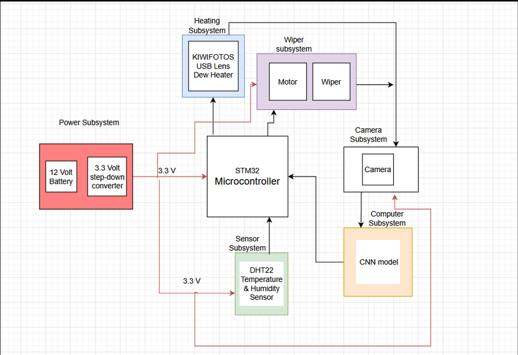

# 2025-02-14- Machine shop initial meeting
Me and another group member brought the diagrams developed from the proposal to the machineshop where we explained how our project function. Greg helped come up with designs utilizing boxes and helped pick out servo motors.

# 2025-02-18- Proposal Review with Professor Fliflet
From the proposal review, Professor Fliflet gave us many ideas on implentation with his many questions such as the the size of the box and where certain elements should be placed. 

# 2025-02-21 - 2025-02-24- Part Research
My group decided to research parts. Through all of the options of servo I decided to pick the HS-318 due to its acessability from the ECE shop and typical sturdiness. It also does not seem to be too hard to code for the function that we desire.

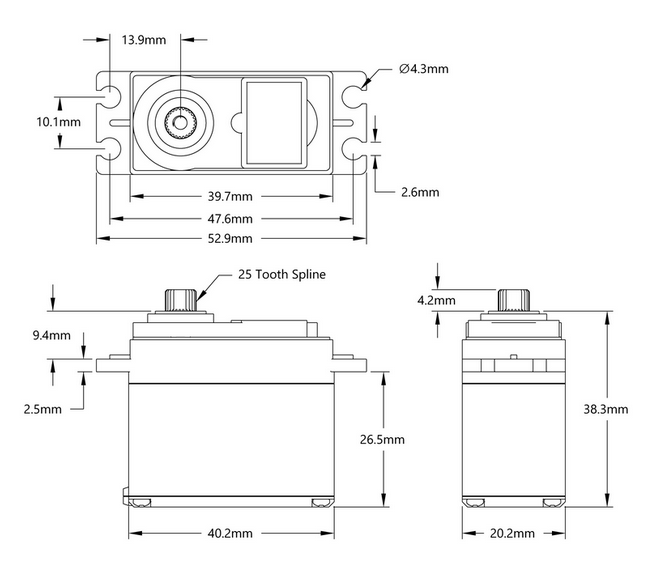
Link for motor https://www.servocity.com/hs-318-servo/

Collectively we decided on utilizing the STM32 Microcontroller due to some members having some past experience with it. We also discovered for what we were doing the humidity sensor was not required. 

# 2025-02-25 Inital PCB design
Utlizing the parts chosen from research my group came together to design the PCB. We generally know how each part needs to connect to the board with for example the motor needing three connectors. At this point we are not too sure how to connect the pins of the microcontroller to most aspects of the board. This design is based on the KiCad assignment. Our design is below.

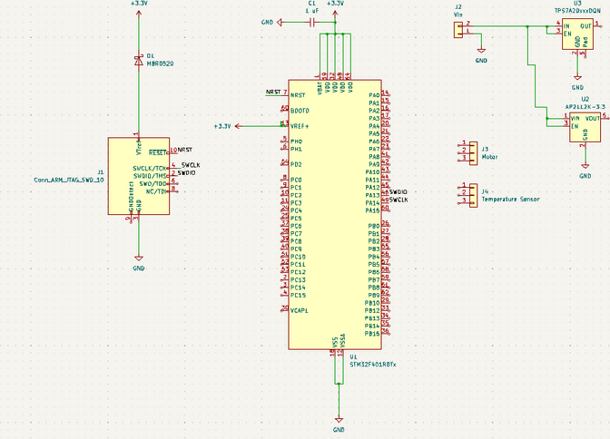

# 2025-02-27 Second PCB design
Our group met up in office hours to check our inital PCB design. We ended up needing to add a decent amount to the design such as a usb connector for the computer subsystem and heater. We also realized that the intial 5V voltage regulator we had implemented was incorrect. The newer design is below. 

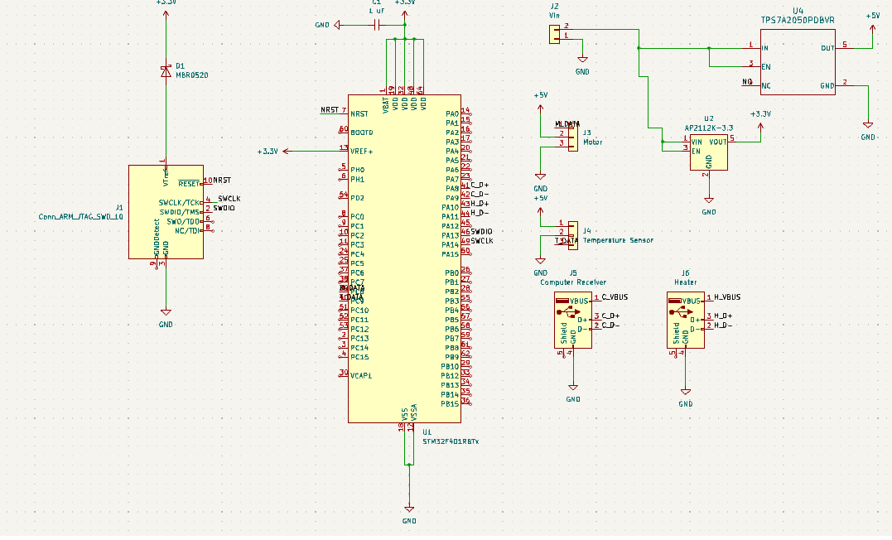

# 2025-02-28 PCB Review
Our group met up for the PCB Review where a TA showed us a design for the STM32 Microcontroller on the website. We also decided to not utilize a heater that needed a USB connection. We decided to use a heater that needed simply power and ground connections. We also realized that in order to have a functioning heater that would turn on with signals from the microcontroller, we needed to convert the 3.3V microcontroller signal to 5V.

# 2025-03-05 Design Document and circuit design
Our group met up to work on the Design Document. While the group worked on some sections togehter, we split up others where I was responsible for part of the design overview and verification tables along with some diagrams. Apart from the design document I worked on the circuit design to convert 3.3V to 5V for the heater and confirmed that it works through testing with a voltmeter. The MOSFET I used is the CD4007UBE Below is the circuit schematic as well as the built circuit.

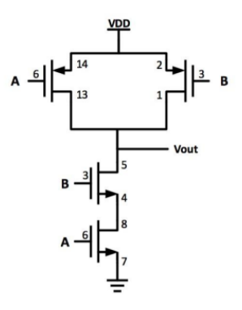 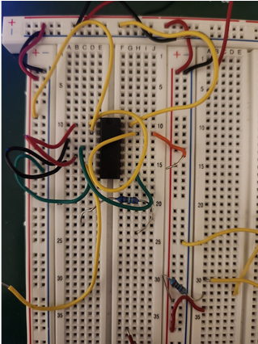

# 2025-03-06 Third PCB Design 
With the changes based on the wiki page that was shown to us from the PCB review as well as the addition of the MOSFET circuit we came to our third interation of the PCB design.

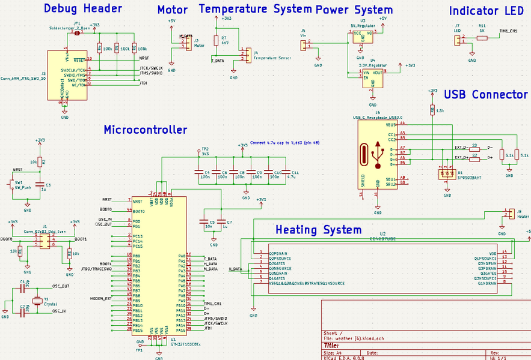

# 2025-03-07 Encoding the Motor
With the heating subsytem needing the least amount of work due to the MOSFET circuit working. We decided to focus on different subsystems where I was in charge of the motor system. When trying to incode the motor for the STM32 development board that we recieved on STM32CUBEIDE, the best I could get was the motor to twitch. Checking with the voltmeter I realized I was failing to generate a proper PWM wave

# 2025-03-08 PWM wave generation and Breadboard Demo Preparation
I decided to focus on generating a proper PWM wave and check it through an oscilliscope on scopy. Using the information on the website about the proper wave along with equations and help from a youtube video I was able to generate a PWM wave with 20ms period and 5% duty cycle. However, the motor is not running despite the PWM wave. Below is the equations used, code for proper duty cycle, and the wave generated. 

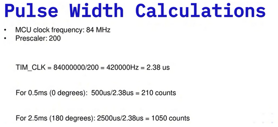 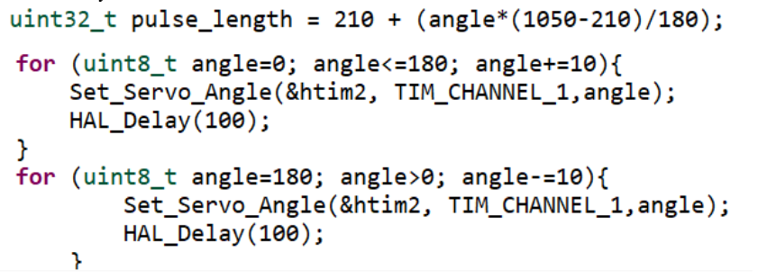 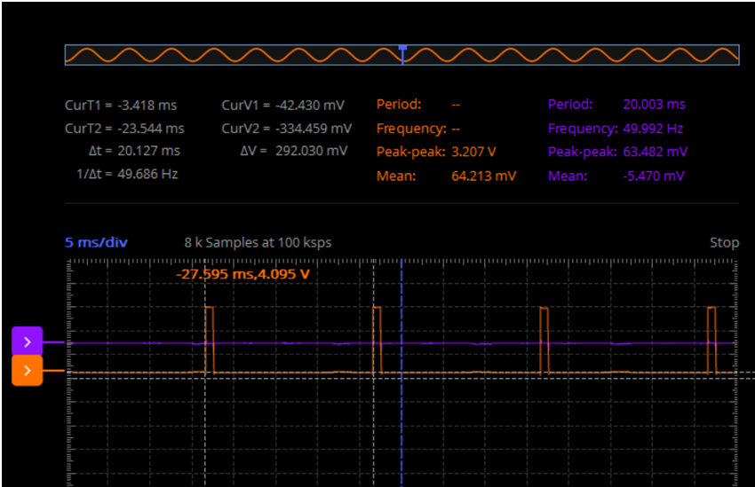

The group also decided to setup our bread board demo where we will showcase the CNN, PWM wave generation, UART working for the temperature sensor, and the MOSFET circuit for the heater.

# 2025-03-11 Wiring PCB Schematic
We met today on zoom where we needed to finish the PCB wiring for the PCB second round. We worked together to place the components where I ended up wiring the rest of it. Although there are 0 unrouted wires, we do not pass the DRC. 

# 2025-03-12 Office hours
In the afternoon me and a group member met up with our TA where we discussed what was wrong with the PCB schematic. I had to leave an hour into the discussion. After returning and through more discussion, the problem was solved through shrinking the wires, making sure each component was connected to both sides of the board, and shrinking certain components. After, I decided to go to office hours to help with the motor issue. Unfortunately even with the TA's help I could not get the motor working with a possible conclusion being that the motor is broken due to my earlier code. Below is our finished PCB schematic

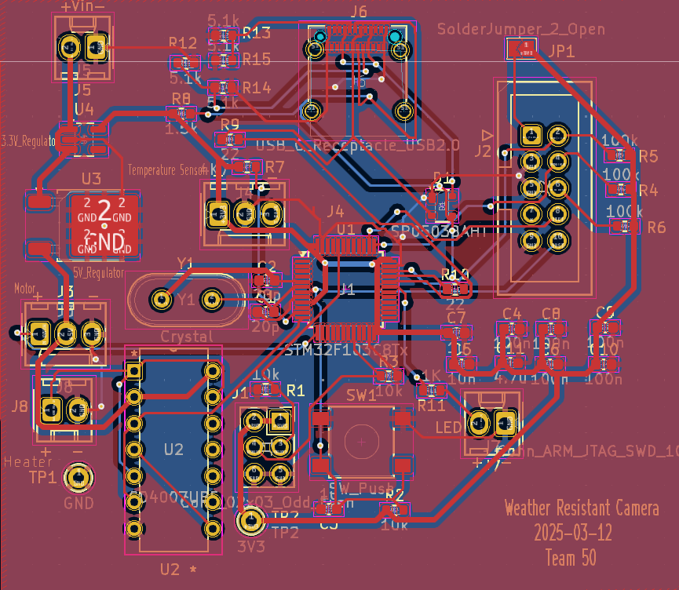

# 2025-03-14 Machine shop
I went to the machine shop with another group memeber where Greg told us to bring a design based upon a box he gave us next time and that our project would not take long to make so we didn't need to give him anything before Spring Break. 

# 2025-03-25 Soldering
We have begun the solder the first PCB and have verified that the power subsystem is working properly as the voltage regulators output 5V and 3.3V with the MOSFET circuit outputting 5V due to no signal from the microcontroller. 

# 2025-03-31 Machine shop
We have given Greg our design for the box and through a servo tester have figured out that the motor was in fact broken.

# 2025-04-02 MOSFET circuit issues
Although we only tested the MOSFET circuit through a voltmeter, we wanted to see if the heater would run with it. Unfortunately the heater is not running and I believe it is a current issue. Thus I decided to use a simpler MOSFET circuit with the IRLZ44N MOSFET. I tested this circuit through LT-SPICE where it gives enough power to the heater. The results from LT-SPICE are below(used sine wave to simulate MOSFET turning on and off) along with the diagram.

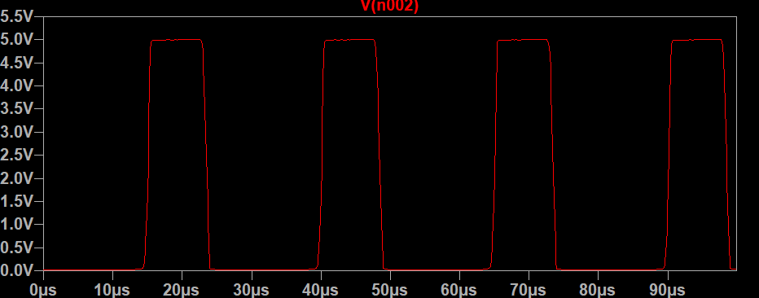 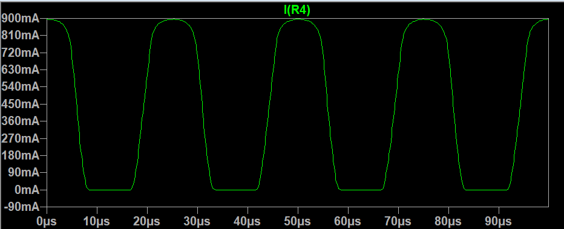 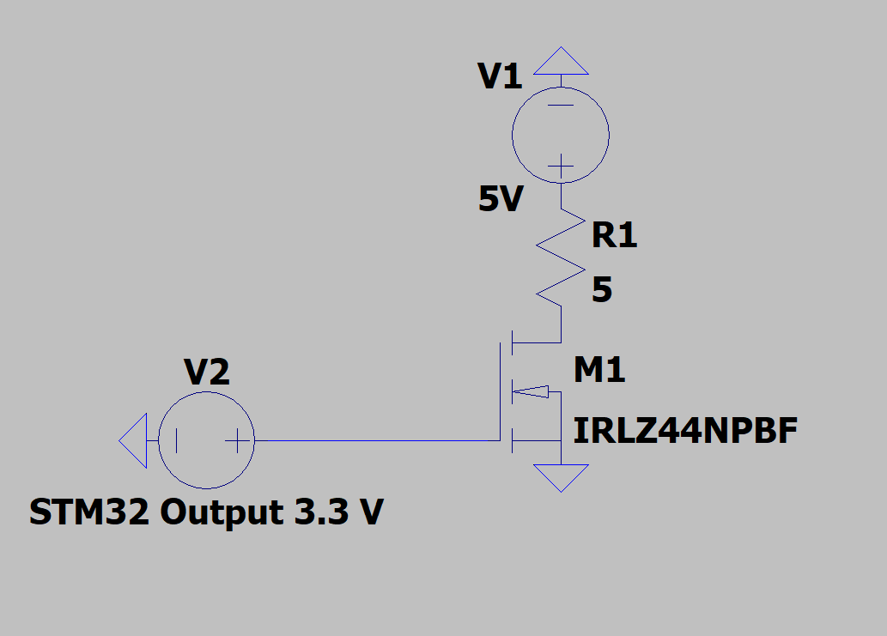

# 2025-04-03 Second Round PCB
Through figuring out what was wrong with our intial PCB design such as the MOSFET circuit, temperature sensor, etc we are starting to design our final PCB.

# 2025-04-08 - 2025-04-10 Subsystem tests
We bought a test motor and the code works with it. With some fine tuning for the specific window size and wiping motion which require the final build to return from the machine shop, the wiper system will be finished. The MOSFET parts also arrived and I was able to build the circuit on the breadboard and test that it properly works with the heater. The built circuit is below.

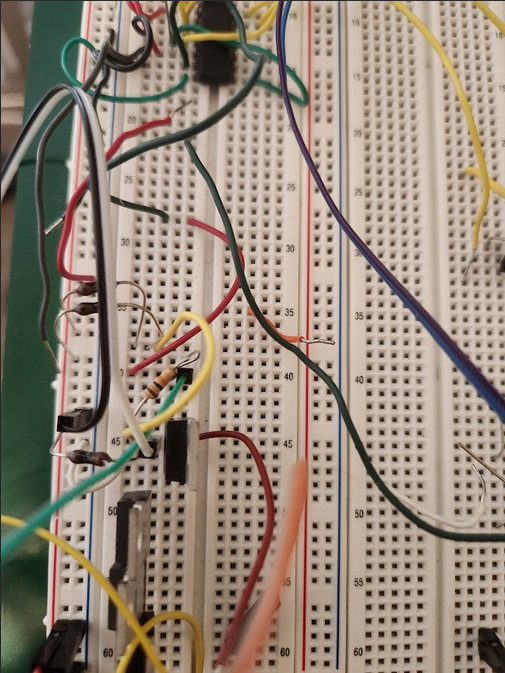

# 2025-04-20 - 2025-04-25 Demo Setup
With recieving our final product and the fourth round PCBs not coming in yet, we decided to focus on getting all subsystems working on the Dev board. We also focused on how we would show each subsytem and in what order with us starting with showing the motor and OpenCv systems working properly using a dropper and putting the temperature sensor of the Dev board into the cooler to show that the heater will turn on at the correct time. Below is images of our Dev board setup.

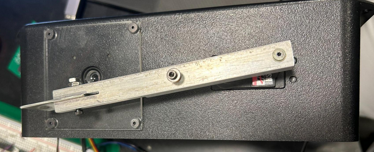 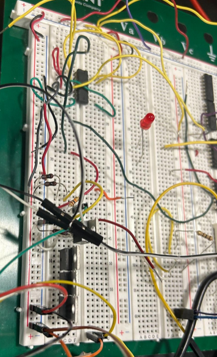 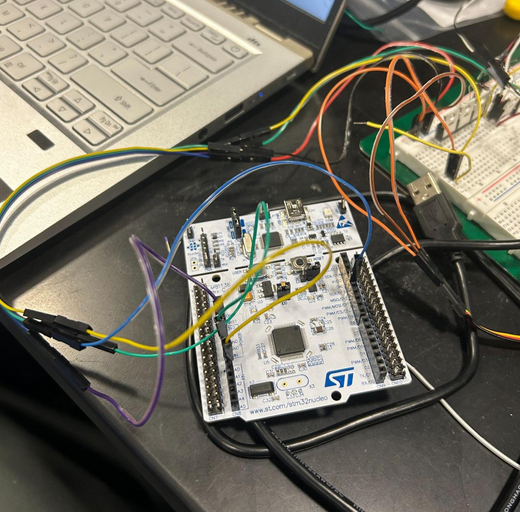 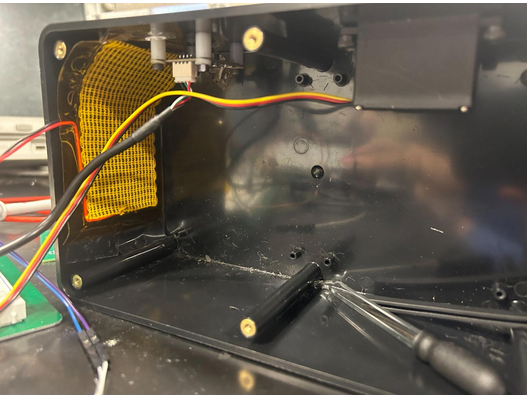

# 2025-04-23 Soldering issues
The fourth round of PCBs arrived and while soldering the only microcontroller we had broke. This leaves us in a difficult situation. Although we ordered another, we will now focus on getting the Dev board fully functional as there is not a lot of time left before the final demo.

# 2025-04-30 Final Demo Result and Final Presentation
Although we were unable to get the PCB functioning in time, the Dev board worked perfectly and was showcased well in the Final Demo. We are now preparing for the final presentation where I primarly focused on the description of our inital design, schematics, changes, and our successes, challenges, and failures slides.

# 2025-05-06 Final Paper
We spoke confidently throughout the Final Presentation and did the best we could. For the Final paper the group decided to split it up where I was mainly focused on the Design aspect of it. Overall this project has been a joy to work on and my group had great communication and dilligence. 

# References

[1] 	A. B. Author, “Let it snow: Winter testing for cars, robots, and drones,” Areaxo, [Online]. 
Available:https://areaxo.com. [Accessed: Feb. 12, 2025].
 
[2] 	Automated Vehicles and Adverse Weather Final Report, Battelle, U.S. Department of 
Transportation Office of the Assistant Secretary for Research and Technology, Federal Highway Administration, FHWA-JPO-19-755, June 2019. [Online]. Available: www.its.dot.gov/index.htm. [Accessed: Feb. 12, 2025].

[3] 	IEEE, “IEEE Code of Ethics,” IEEE Corporate Governance, [Online]. Available: 
https://www.ieee.org/about/corporate/governance/p7-8.html. [Accessed: Feb. 12, 2025].
 
[4] 	ACM, “ACM Code of Ethics,” ACM, [Online]. Available: 
https://www.acm.org/code-of-ethics. [Accessed: Feb. 12, 2025].
 
[5] 	IEEE, “IEEE Citation Guidelines,” IEEE Dataport, [Online]. Available: https://ieee-dataport.org/ 
sites/default/files/analysis/27/IEEE%20Citation%20Guidelines.pdf. [Accessed: Feb. 12, 2025].
 
[6]	HS-318 Servo-Stock Rotation, “HS-318 Servo-Stock Rotation,” ServoCity®, 2025. 
https://www.servocity.com/hs-318-servo/. [Accessed: Mar. 6, 2025].
 
[7]	“0.3 MegaPixels USB Camera for Raspberry Pi and NVIDIA Jetson Nano 
SKU:FIT0701.” Available: https://mm.digikey.com/Volume0/opasdata/d220001/medias/docus/ 
2719/FIT0701_Web.pdf. [Accessed: Mar. 6, 2025].
 
‌[8]	“Waterproof DS18B20 Digital Temperature Sensor for Arduino.” Accessed: Mar. 06,      
2025. [Online]. Available: https://mm.digikey.com/Volume0/opasdata/d220001/medias/docus/ 3786/DFR0198_Web.pdf. [Accessed: Mar. 6, 2025].
 
[9]	“NUCLEO-F401RE - STM32 Nucleo-64 development board with STM32F401RE MCU, 
supports Arduino and ST morpho connectivity - STMicroelectronics,” www.st.com. https://www.st.com/en/evaluation-tools/nucleo-f401re.html. [Accessed: Mar. 6, 2025].
 
‌[10]	“Heating Pad -5x10cm.” Accessed: Mar. 06, 2025. [Online]. Available: https://mm.digikey.com/ 
Volume0/opasdata/d220001/medias/docus/2511/COM-11288_Web.pdf. [Accessed: Mar. 6, 2025].
 
[11]	“STM32F103C8 - STMicroelectronics,” STMicroelectronics, 2019. https://www.st.com/en/ 
microcontrollers-microprocessors/stm32f103c8.html. [Accessed: Mar. 6, 2025].
 
‌[13]	Engineering IT Shared Services, “:: ECE 445 - Senior Design Laboratory,” Illinois.edu, 
2025. https://courses.grainger.illinois.edu/ece445/wiki/#/stm32_example/index?id= stm32- example-lora-router. [Accessed: Mar. 6, 2025].
 
[14]	“Servo Motor Control with STM32 | EASY TUTORIAL | STM32CUBEIDE,”
Youtube, uploaded by CircuitGator HQ, 15 January 2025, https://www.youtube.com/watch?v=0aTMuiHVx_g. [Accessed: Apr. 2, 2025].